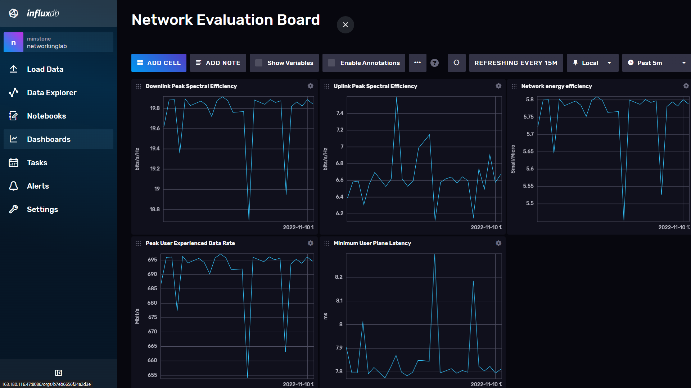

# Edge-AI domain-specific Deep Learning-based Resource Management Performance Evaluation

## Overview
This is the Simulation code for Edge AI domain specific deep learning based resource management performance evaluation

## Evaluation procedure
1) 테스트 횟수 및 연결 사용자 수 설정
2) 각 사용자에 대한 목표 항목별 성능 측정 후 평균 성능 도출
3) 성능 측정 코스 실행 후 정상적으로 성능 관리 서버로 테스트 결과 전달이 되었는지 확인
4) 성능 관리 홈페이지에서 실시간 성능 확인
5) 1분 측정 뒤 평균 성능으로 해당 시험 결과 확인

## Version
- python 3.8
- InfluxDB v2.4.0

## License
Copyright (c) 2021 Networking Intelligence
Redistribution and use in source and binary forms, with or without modification, are permitted provided that the following conditions are met:

1. Redistributions of source code must retain the above copyright notice, this list of conditions and the following disclaimer.

2. Redistributions in binary form must reproduce the above copyright notice, this list of conditions and the following disclaimer in the documentation and/or other materials provided with the distribution.

THIS SOFTWARE IS PROVIDED BY THE COPYRIGHT HOLDERS AND CONTRIBUTORS "AS IS" AND ANY EXPRESS OR IMPLIED WARRANTIES, INCLUDING, BUT NOT LIMITED TO, THE IMPLIED WARRANTIES OF MERCHANTABILITY AND FITNESS FOR A PARTICULAR PURPOSE ARE DISCLAIMED. IN NO EVENT SHALL THE COPYRIGHT HOLDER OR CONTRIBUTORS BE LIABLE FOR ANY DIRECT, INDIRECT, INCIDENTAL, SPECIAL, EXEMPLARY, OR CONSEQUENTIAL DAMAGES (INCLUDING, BUT NOT LIMITED TO, PROCUREMENT OF SUBSTITUTE GOODS OR SERVICES; LOSS OF USE, DATA, OR PROFITS; OR BUSINESS INTERRUPTION) HOWEVER CAUSED AND ON ANY THEORY OF LIABILITY, WHETHER IN CONTRACT, STRICT LIABILITY, OR TORT (INCLUDING NEGLIGENCE OR OTHERWISE) ARISING IN ANY WAY OUT OF THE USE OF THIS SOFTWARE, EVEN IF ADVISED OF THE POSSIBILITY OF SUCH DAMAGE.
